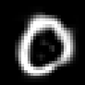
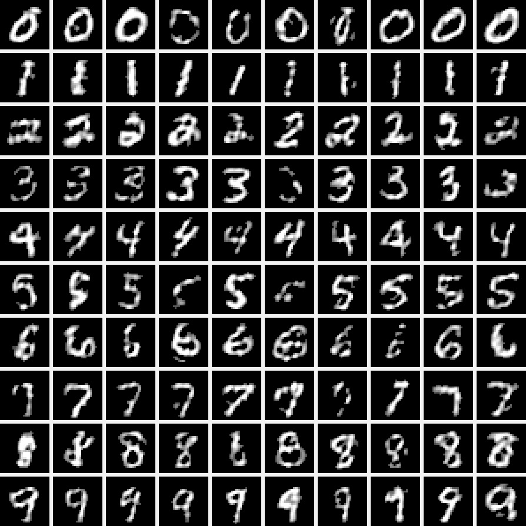
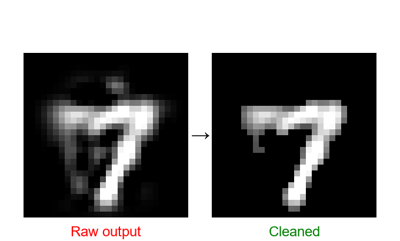

# 🎲 This Number Does Not Exist

[](https://opensource.org/licenses/MIT)
[](https://www.python.org/downloads/)
[](https://scikit-learn.org/)
[](https://sofianebeloucif.github.io/ThisNumberDoesNotExit/)

Generate realistic handwritten digits using classical : **Kernel Density Estimation + PCA + Rejection Sampling**. A lightweight alternative to GANs that's 40× faster to train and 10× smaller.

[🎮 Live Demo](https://sofianebeloucif.github.io/ThisNumberDoesNotExit/) | [📖 Documentation](docs/TECHNICAL.md) | [🤝 Contributing](CONTRIBUTING.md)

<p align="center">
  
</p>


---

## ✨ Features

### **Core Capabilities**
* 🎯 **Conditional Generation**: Choose exactly which digit to generate (0-9).
* 🎨 **High Quality**: Rejection sampling + image cleaning for artifact-free results.
* 💾 **Lightweight**: Models are 5-15 MB (10-100× smaller than GANs).
* 🔬 **Classical ML**: Uses PCA + KDE instead of neural networks.
* ⚙️ **Auto-Tuned**: Bandwidth optimization via cross-validation.
* 🌐 **Web Interface**: Real-time generation in your browser.

### **Technical Highlights**
* **PCA**: Dimensionality reduction (784D → 50D) retaining ~82% variance.
* **KDE**: Kernel Density Estimation with Gaussian kernel.
* **Rejection Sampling**: Three quality levels (Light/Medium/Strict).
* **Image Cleaning**: Bilateral denoising + morphological operations.
* **Two Architectures**: Global (single model) vs Conditional (one per digit).

---

## 🎬 Demo

### **Interactive Generation**


*100 unique digits generated with our conditional model*

### **Quality Improvement**


*Before and after: image cleaning*

---

## 🚀 Quick Start

### **Prerequisites**
- Python 3.8+
- pip
- 2GB RAM minimum

### **Installation**

```bash
# Clone the repository
git clone https://github.com/SofianeBelouCIF/ThisNumberDoesNotExit.git
cd ThisNumberDoesNotExit

# Create virtual environment (recommended)
python -m venv venv
source venv/bin/activate  # Linux/Mac
# or
venv\Scripts\activate     # Windows

# Install dependencies
pip install -r requirements.txt
```

### **Training Models**

```bash
# Launch Jupyter
jupyter notebook notebooks/train_and_compare.ipynb
```

The notebook will:
1. ✅ Auto-optimize bandwidth via **5-fold cross-validation**
2. ✅ Train both Global and Conditional generators
3. ✅ Compare performance (speed, size, quality)
4. ✅ Generate visualizations
5. ✅ Save models to `models/`

⏱️ **Training time**: ~3-5 minutes on CPU

### **Running Web App (Local)**

```bash
cd app
python app.py
```

Open: **http://localhost:5000**

---

## 🎮 Usage

### **Basic Controls**
- **Mode Selection**: Global (random) or Conditional (choose digit)
- **Digit Picker**: Select 0-9 (conditional mode only)
- **Rejection Sampling**: Toggle quality filtering
- **Image Cleaning**: Remove artifacts (light/medium/aggressive)

### **Python API**

```python
from src.generator import GlobalGenerator, ConditionalGenerator

# --- Global Generator ---
global_gen = GlobalGenerator.load('models/global_generator.pkl')

# Generate 10 random digits
images = global_gen.generate(
    n_samples=10,
    use_rejection=True,
    percentile=25,
    clean_images=True,
    cleaning_method='medium'
)

# --- Conditional Generator ---
cond_gen = ConditionalGenerator.load('models/conditional_generator.pkl')

# Generate 10 sevens
sevens = cond_gen.generate(
    digit=7,
    n_samples=10,
    use_rejection=True,
    percentile=25,
    clean_images=True,
    cleaning_method='medium'
)

# Generate all digits (10 of each)
all_digits = cond_gen.generate_all(n_samples_per_digit=10)
```

---

## 🛠️ Architecture

### **Pipeline Overview**

```
MNIST (60k images, 28×28)
    ↓
[ PCA: 784D → 50D ]  (~82% variance retained)
    ↓
[ KDE: Density Estimation ]  (Gaussian kernel, optimized bandwidth)
    ↓
[ Sampling + Rejection ]  (Filter by log-likelihood)
    ↓
[ PCA Inverse: 50D → 784D ]
    ↓
[ Image Cleaning ]  (Denoise + threshold + morphology)
    ↓
Generated Image (28×28)
```

### **Two Architectures**

| Architecture | Description | Model Size | Training Time | Use Case |
|--------------|-------------|------------|---------------|----------|
| **🌍 Global** | Single KDE for all digits | ~5 MB | ~3s | Random generation |
| **🎯 Conditional** | 10 KDE (one per digit) | ~15 MB | ~10s | Targeted generation |

---

---

## 🎯 Rejection Sampling

Improve generation quality by filtering samples based on log-likelihood.

| Level | Percentile | Acceptance Rate | Speed |
|-------|-----------|-----------------|---------|
| 🟢 **Light** | 10% | ~85% | Fast ⚡ |
| 🟡 **Medium** | 25% | ~65% | Normal |
| 🔴 **Strict** | 50% | ~45% | Slower |

**Formula:**
$$
\text{Accept if: } \log p(x) \geq \text{threshold}_{\text{percentile}}
$$

Where $p(x)$ is the KDE-estimated probability density.

---

## 🧹 Image Cleaning

Post-process generated images to eliminate artifacts.

### **Cleaning Methods**

| Method | Pipeline | Effect                                  | Speed |
|--------|----------|-----------------------------------------|-------|
| **🟢 Light** | Threshold (0.2) | Minimal cleanup                         | Fast |
| **🟡 Medium** | Threshold (0.25) + Small components removal | Balanced                                | Normal |
| **🔴 Aggressive** | Bilateral denoise + Threshold (0.3) + Morphology | Maximum quality but risk of degradation | Slower |

**Recommended:** Medium for general use, Aggressive if many artifacts persist.

---

## 📚 Documentation

### **Algorithm Details**

**Kernel Density Estimation (KDE)**
$$
\hat{f}(x) = \frac{1}{nh} \sum_{i=1}^{n} K\left(\frac{x - x_i}{h}\right)
$$

Where:
- $K$ is the Gaussian kernel
- $h$ is the bandwidth (auto-optimized via grid search)
- $n$ is the number of training samples

**Cross-Validation for Bandwidth**
```python
bandwidths = np.linspace(0.5, 2.5, 10)
grid = GridSearchCV(KernelDensity(), {'bandwidth': bandwidths}, cv=5)
grid.fit(data)
optimal_bandwidth = grid.best_params_['bandwidth']
```

### **Biome Mapping Analogy**

Similar to terrain generation, our model maps the latent space into "digit biomes":

```
if log_density < threshold_10% → Reject
elif log_density < threshold_25% → Accept (Light)
elif log_density < threshold_50% → Accept (Medium)
else → Accept (Strict)
```

See [Technical Documentation](docs/TECHNICAL.md) for deep dive.

---


## 🤝 Contributing

Contributions welcome! See [CONTRIBUTING.md](CONTRIBUTING.md).

### **Ideas for Enhancement**
- [ ] Fashion-MNIST support
- [ ] CIFAR-10 (color images)
- [ ] FID/IS metrics
- [ ] Docker container
- [ ] Latent space interpolation
- [ ] Style transfer
- [ ] Multi-modal generation (digits + letters)
- [ ] Mobile app (iOS/Android)

---

## 📝 License

This project is licensed under the MIT License - see [LICENSE](LICENSE) for details.

---

## 👤 Author

**Sofiane Beloucif**
- 🌐 Portfolio: [sofianebeloucif.com](https://sofianebeloucif.com)
- 💼 GitHub: [@SofianeBeloucif](https://github.com/sofianebeloucif)
- 🚀 Live Demo: [ThisNumberDoesNotExist](https://sofianebeloucif.github.io/ThisNumberDoesNotExit/)

---

## 🙏 Acknowledgments

* **Yann LeCun** for MNIST dataset: [http://yann.lecun.com/exdb/mnist/](http://yann.lecun.com/exdb/mnist/)
* **scikit-learn** team for excellent ML tools: [https://scikit-learn.org/](https://scikit-learn.org/)
* **ThisPersonDoesNotExist** for inspiration: [https://thispersondoesnotexist.com/](https://thispersondoesnotexist.com/)
* Sebastian Lague's procedural generation tutorials

---

## 📖 Citation

If you use this project in your research, please cite:

```bibtex
@misc{thisnumberdoesnotexist2024,
  author = {Beloucif, Sofiane},
  title = {This Number Does Not Exist: MNIST Generation with PCA + KDE},
  year = {2024},
  publisher = {GitHub},
  url = {https://github.com/SofianeBelouCIF/ThisNumberDoesNotExit}
}
```


---

<div align="center">

### ⭐ Star this repo if you find it useful!

[](https://github.com/SofianeBelouCIF/ThisNumberDoesNotExit/stargazers)

**Made with ❤️ and lots of ☕**

[🎮 Try the Demo](https://sofianebeloucif.github.io/ThisNumberDoesNotExit/) • [📖 Read the Docs](docs/TECHNICAL.md) • [🐛 Report Bug](https://github.com/SofianeBelouCIF/ThisNumberDoesNotExit/issues)

</div>